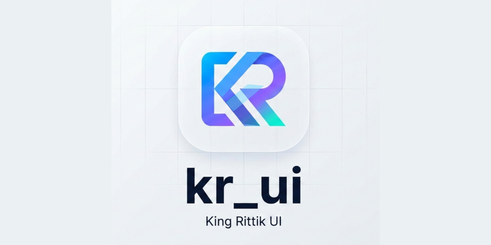

# kr_ui

<div align="center">

**Premium glassmorphic UI, Elegant Simple & Clean UI components for Flutter**

Flutter UI components library with glassmorphic, elegant, minimal & clean UI components. Beautiful, customizable widgets with animations & frosted glass effects. Pure Flutter, zero dependencies.

[](https://pub.dev/packages/kr_ui)
[](https://pub.dev/packages/kr_ui/score)
[](/packages/kr_ui/LICENSE)
[](https://rittiksoni.github.io/kr_ui/)

[](https://github.com/RittikSoni/kr_ui/actions/workflows/ci.yml)
[](https://github.com/RittikSoni/kr_ui/issues)
[](https://github.com/RittikSoni/kr_ui/pulls)
<!-- [](https://codecov.io/gh/RittikSoni/kr_ui) -->


[](https://github.com/sponsors/RittikSoni)
[](https://www.youtube.com/@king_rittik?sub_confirmation=1)
[](https://discord.gg/Tmn6BKwSnr)
[](https://github.com/RittikSoni/kr_ui)

[Get Started](#-installation) • [Live Demo](#-live-demo) • [Quick Start](#-quick-start) • [Community](#-community)



</div>

---

## ✨ Features

- 🎨 **Beautiful Glassmorphism** - iOS-style frosted glass effects
- 🎨 **Elegant Simple & Clean UI** : quick and easy to use.
- 🔧 **Fully Customizable** - Control blur, opacity, colors, borders
- ⚡ **Zero Dependencies** - Pure Flutter implementation
- 📱 **Production Ready** - Battle-tested components
- 🎯 **Easy to Use** - Clean API with sensible defaults
- 📚 **Well Documented** - Comprehensive examples and guides

---

## 📦 Installation

Add kr_ui to your `pubspec.yaml`:

```yaml
dependencies:
  kr_ui: <latest_version>
```

Then run:

```bash
flutter pub get
```

---

## 🚀 Quick Start

```dart
import 'package:flutter/material.dart';
import 'package:kr_ui/kr_ui.dart';

void main() => runApp(MyApp());

class MyApp extends StatelessWidget {
  @override
  Widget build(BuildContext context) {
    return MaterialApp(
      home: Scaffold(
        body: Center(
          child: Stack(
            children: [
              // Background image
              Image.network(
                'https://images.unsplash.com/photo-1618005182384-a83a8bd57fbe',
                fit: BoxFit.cover,
                width: double.infinity,
                height: double.infinity,
              ),
              
              // Glassy card on top
              Center(
                child: KruiGlassyCard(
                  child: Column(
                    mainAxisSize: MainAxisSize.min,
                    children: [
                      Icon(Icons.auto_awesome, size: 48),
                      SizedBox(height: 16),
                      Text(
                        'Glassmorphism',
                        style: TextStyle(fontSize: 24, fontWeight: FontWeight.bold),
                      ),
                      SizedBox(height: 8),
                      Text('Beautiful frosted glass effects'),
                    ],
                  ),
                ),
              ),
            ],
          ),
        ),
      ),
    );
  }
}
```

---

## 🧩 Components & Roadmap

✅ Accordion

✅ Carousel (with built-in indicators, animations, and more)

✅ GlassyCard

✅ ContentCard

✅ GlassyButton

✅ SimpleButton

✅ GlassyIconButton

✅ SimpleIconButton

✅ Toast

✅ Snackbar

✅ Form

✅ TextField (with built-in validators, error messages, and more)

✅ Select

✅ MultiSelect

✅ RadioGroup

✅ Checkbox

✅ Switch

✅ DatePicker

✅ Calendar

✅ TimePicker

✅ showKruiGlassyDialog

✅ showKruiSimpleDialog

✅ showKruiGlassySheet

✅ showKruiSimpleSheet

✅ FloatingDock

✅ RippleReveal

✅ SkeletonShimmer

✅ Confetti

✅ GlowButton

✅ AnimatedGradientBackground

✅ ParticleBurst

✅ OTPInput

✅ ChipGroup

✅ AnimatedGradientBorder

✅ Countdown

check out [kr_ui_docs](https://rittiksoni.github.io/kr_ui/) for more examples

more Coming soon! Stay tuned! & Don't forget to [🌟 Star](https://github.com/RittikSoni/kr_ui) this repo if you like it!

---

## 🎬 Live Demo

Try out all components in our interactive showcase app:

**[Launch Showcase App](https://rittiksoni.github.io/kr_ui/)**

Or run locally:

```bash
git clone https://github.com/RittikSoni/kr_ui.git
cd kr_ui
melos bootstrap
cd apps/kr_ui_docs
flutter run -d chrome
```

---

## 📱 Platform Support

| Platform | Supported |
|----------|-----------|
| iOS | ✅ |
| Android | ✅ |
| Web | ✅ |
| macOS | ✅ |
| Windows | ✅ |
| Linux | ✅ |

---

## 🤝 Contributing

We welcome contributions! Please see our [Contributing Guide](CONTRIBUTING.md) for details.

**Ways to contribute:**
- 🐛 Report bugs
- ✨ Suggest new components
- 🎨 Submit new designs
- 📚 Improve documentation
- 💬 Help others in discussions

---

## 👥 Community

Join the kr_ui community:

- 💬 **Discord**: [Join Server](https://discord.gg/Tmn6BKwSnr)
- 🎥 **YouTube**: [@king_rittik](https://www.youtube.com/@king_rittik)
- 🐛 **Issues**: [GitHub Issues](https://github.com/RittikSoni/kr_ui/issues)

---

## 📄 License

This project is licensed under the MIT License - see the [LICENSE](LICENSE) file for details.

---

## 🙏 Acknowledgments

Created with ❤️ by [King Rittik](https://www.youtube.com/@king_rittik)

Inspired by:
- iOS glassmorphism design
- Flutter's Material Design 3
- The amazing Flutter community

---

## ⭐ Show Your Support

If you like kr_ui, please give it a star on GitHub and like it on pub.dev! It helps others discover this package.

[](https://github.com/RittikSoni/kr_ui)

---

<div align="center">

**Built with Flutter 💙**

Made by [King Rittik](https://www.youtube.com/@king_rittik) for the Flutter community

</div>
